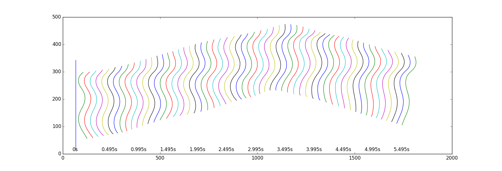
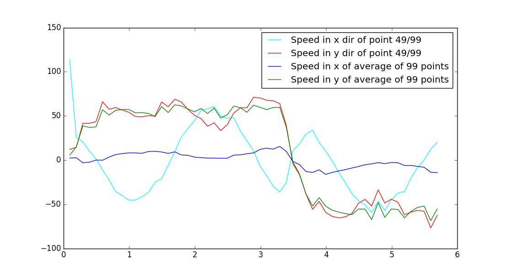

## Test conversion of Sibernetic output to WCON

Example output produced by Sibernetic & some Python scripts for converting this to WCON.

**Work in progress!**

Sibernetic original data is in [crawling_at_agar.txt](crawling_at_agar.txt).

The file [generate_wcon.py](generate_wcon.py) can be used to convert this into WCON.

Example of the output in WCON can be seen [here](sibernetic_test_small.wcon) (or a longer version [here](sibernetic_test_full.wcon)).

The activity of the worm (generated from the original data, not WCON) can be seen below:

The speed of the worm during this can be plotted:

